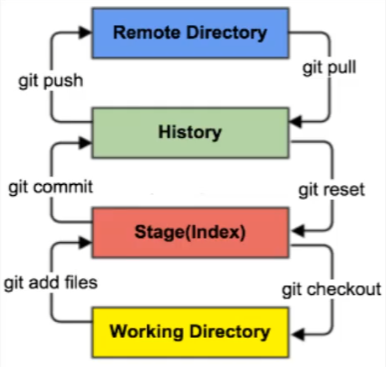
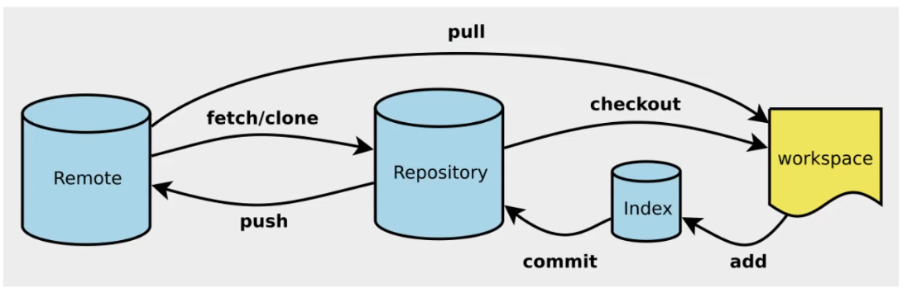
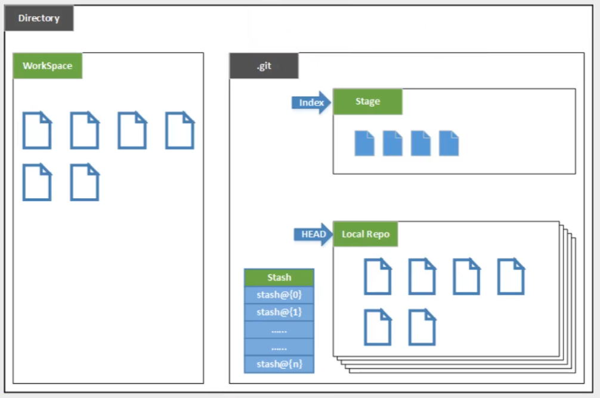
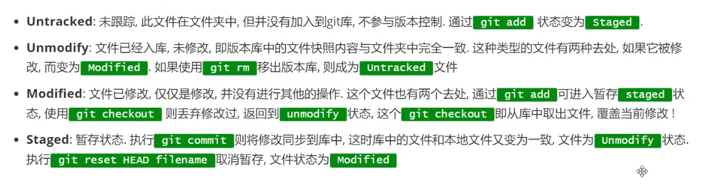
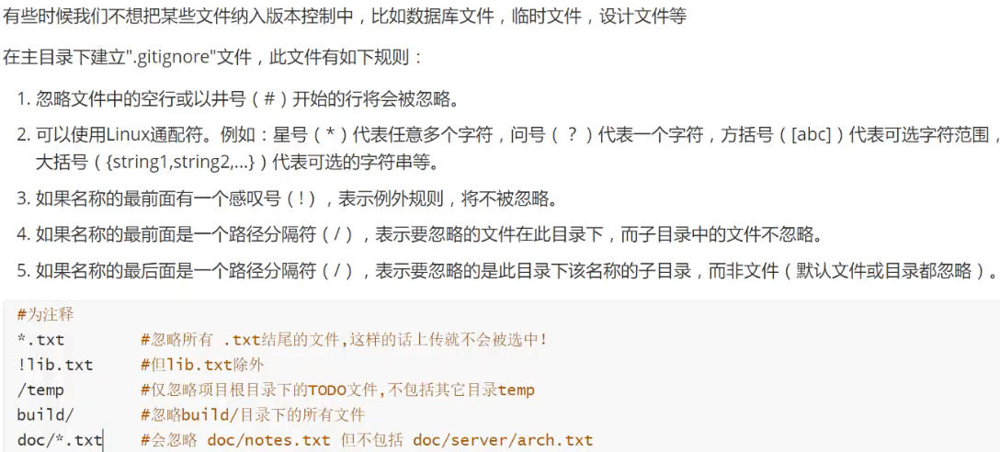

### Git

> 分布式版本控制（SVN则是集中式版本控制，只有中央服务器有版本库）

* 一些config指令

  * git config -l	查看本地配置
  * git config --system --list	查看系统配置
  * git config --global --list	查看用户配置
  * git config --global user.name "name123"	配置用户名
  * git config --global user.email "610222611@qq.com"	配置邮箱

* **基础理论**

  > 工作区域

  

  

  > 内部构造

  

  * Working Directory
    * 本地代码存放位置（工作目录）
  * Index / Stage
    * 暂存区，临时存放改动，保存提交到文件的列表信息
  * Repository
    * 本地仓库，安全存放数据位置，有所有版本数据。HEAD指向最新版本
  * Remote
    * 远程仓库

  > 工作流程

  1. 在Working Directory添加 / 修改文件
  2. 将需要版本管理的文件放入暂存区
  3. 将暂存区文件提交至本地Git仓库

  > 文件状态

  

  > git 指令

  ``` bash
  git status [filename]	# 查看指定文件状态
  git branch	# 查看分支 -r 查看远程分支
  git branch [branch name]	# 新建分支,但不切换
  git checkout -b [branch]	# 新建分支并切换
  git merge [branch]	# 合并分支到当前分支
  git branch -d [branch-name]	# 删除本地分支 D强制删除
  git push gitee -d [branch-name]	# 删除远程分支
  ```

* 项目操作流程

  1. 创建仓库：git init(本地初始化)  git clone \[url](远程克隆)
  2. 添加文件到暂存区：git add .
  3. 提交文件到本地仓库：git commit -m "==works==" works是提交信息
  4. 忽略文件：gitignore

  


​	