准成人经胸超声心动图（TTE） Two-Dimensional (2D) Transthoracic Echocardiographic

切面分类

1. 胸骨旁长轴观(**PLAX**)

   * 胸骨旁左心室长轴观(**LV**)

     * **左室长轴**

       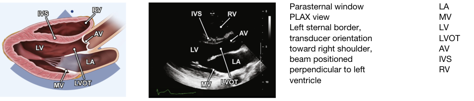

     * ...放大/前后联合部

   * 右心室流出道观(**RV OutFlow**)

     * **右室流出道**

       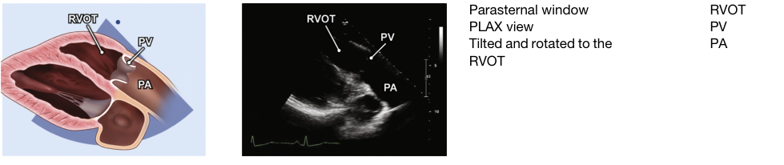

   * 右室流入道切面(**RV InFlow**)

     * **右室流入道**

       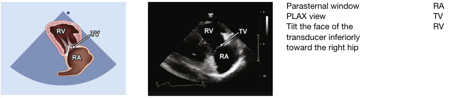

   * 胸骨旁短轴观(**PSAX**)

     * **左室短轴肺动脉瓣中心**

       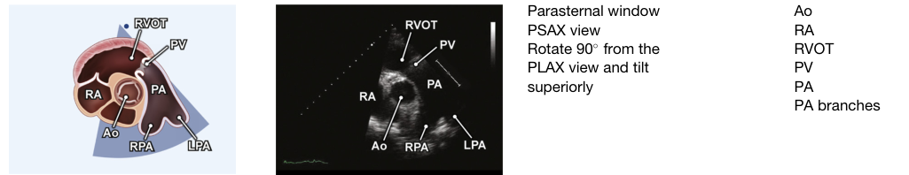

     * **左室短轴主动脉瓣中心**

       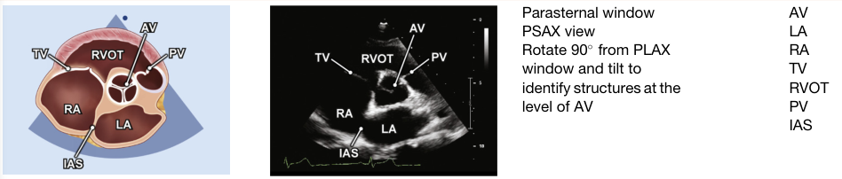

     * **左室短轴三尖瓣中心**

       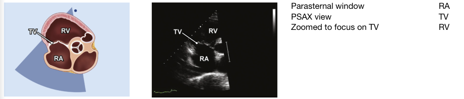

     * **左室短轴二尖瓣水平**

       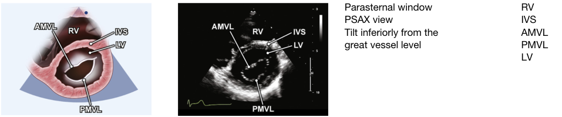

     * **左室短轴乳头肌水平**

       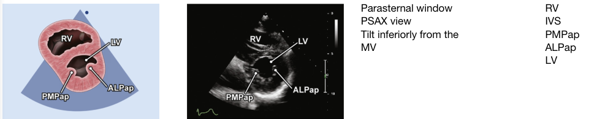

     * **左室短轴心尖水平**

       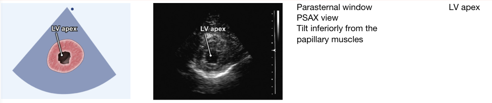

2. 心尖系列切面

   * 心尖四腔观(**A4C**)

     * **心尖四腔心**

       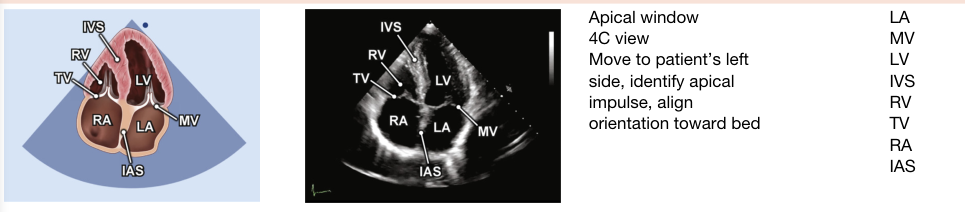

     * ...放大/心尖长轴/肺静脉

     * **放大LA心尖四腔心（肺静脉中心）**

       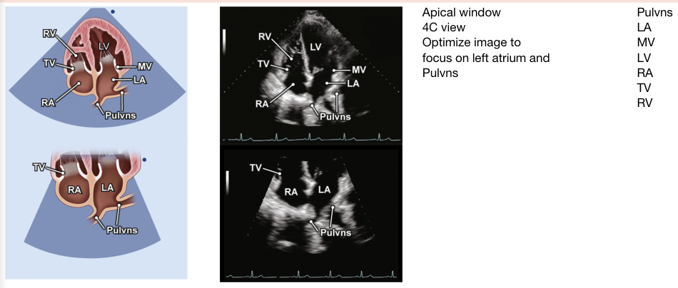

     * **四腔心后侧角**(冠状静脉窦切面(???))

       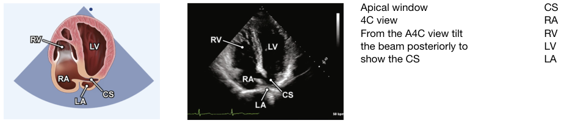

     * **放大LV心尖四腔心**

       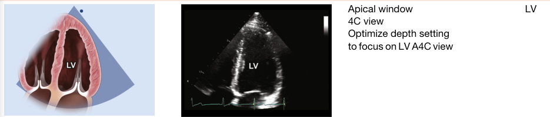

   * 心尖五腔观(**A5C**)

     * **心尖五腔心**

       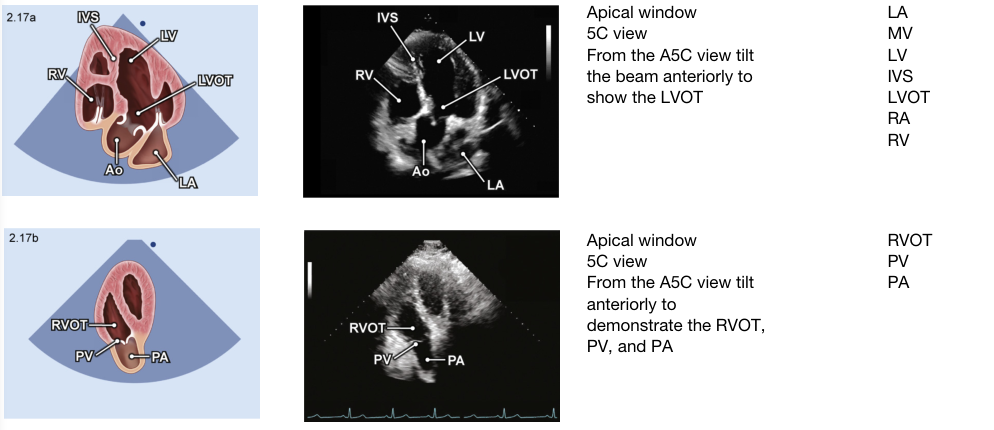

   * 两腔观(**A2C**)

     * **心尖二腔心**

       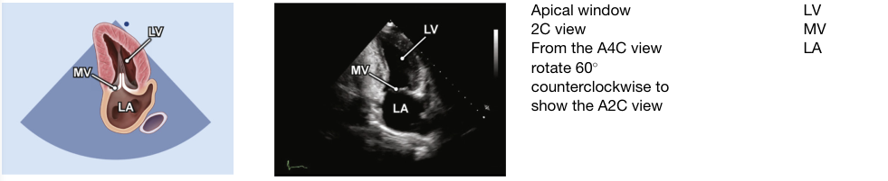

     * ...放大

   * 心尖长轴观（三腔心）(**ALAX** Apical long axis)

     * **心尖长轴**

       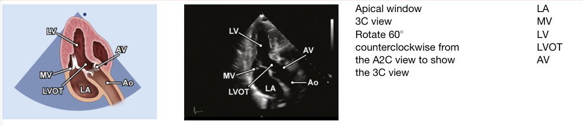

     * ...放大

3. 剑突下声窗与切面

   * 剑突下四腔心切面(**SC 4C**)

     * **剑突下四腔心**

       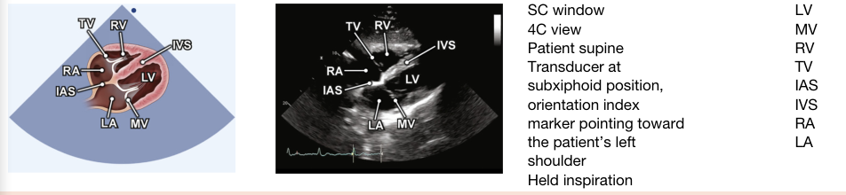

   * 剑突下短轴切面 （心窝部矢状切面）(???)

     * **剑突下下腔静脉长轴**

       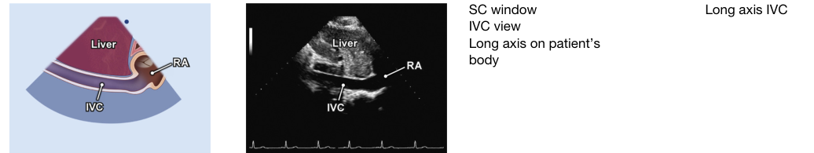

     * **剑突下肝静脉长轴**

       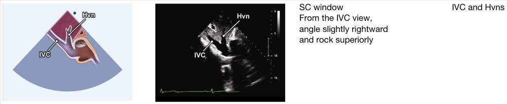

4. 胸骨上窝长轴切面

   * 胸骨上窝主动脉弓(**SSN aortic arch**)

     * **胸骨上窝主动脉弓**

       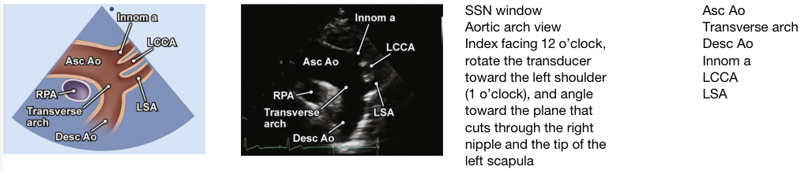

