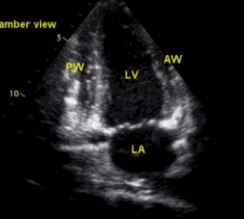

# 超声心动图   

## 主要心脏部位名称
*见心动图标记中英文对照表*

## 主要切面实例

1. 关于心脏与其长轴短轴与四腔心切面
    
      * 上图就是长轴切面
  

    
     * 长轴：矢状切面
     * 短轴：冠状切面
     * 四腔心：水平切面

2. 主要长轴切面
   
   1. 左室长轴

        通常要尽可能对准正中部(此时腱索与前后乳头肌不明显)，但对于特殊需求(二尖瓣脱垂、腱索断裂)的情况，需要检查前后联合部的长轴切面

        

        

        

        下面为标准的左室长轴切面(gif)，各个部位如图所示(前后联合部腱索与乳头肌较为明显)

        

    1. 左室短轴

        在左室长轴切面的基础上把探头顺时针转 90 度就是左室短轴心底切面（也叫主动脉根部切面）。
        

        以探头倾斜的不同角度可以得到左室短轴的另外三个切面—————二尖瓣切面、腱索乳头肌切面和心尖切面。(与切萝卜类似，倾斜不同角度得到不同高度的切面)

        
        
        由上至下重要切面依次为：

        1. 主动脉根部短轴切面
   
           

        2. 二尖瓣口短轴切面

            

        3. 乳头肌短轴切面

        4. 心尖部短轴切面(心尖部相较于乳头肌切面略小一些)
   

     3. 心尖部    
    心尖的四腔切面是最重要的标准切面之一，这里可以评价心脏四个心腔大小，观察房间隔室间隔完整性，可以观察二尖瓣、三尖瓣运动情况。在心尖的四腔切面基础上探头逆时针转动 90 度就是心尖二腔切面，该切面主要观察左心室壁运动。在心尖的四腔切面基础上，探头角度稍稍上斜，可同时显示左室流出道和主动脉瓣，常称为心尖的五腔切面，其实并没有多出一个心腔，左室流出道和主动脉瓣属于左心腔一部分。

        1. 心尖四腔切面
        
        

        2. 心尖二腔切面
        
        

        3.  心尖五腔切面
        

    4. 剑突下
   
        现在来到剑突下声窗，这个声窗很多切面和其它声窗是重复的，前面说过了虽然解剖形态相同但由于观察角度不一样，有辅助意义。

        1. 剑突下四腔心
   
           剑突下声窗四腔切面作为心尖四腔切面的辅助观察区，其实它们切的是同一个平面，即它们所切的平面成像一模一样。
           

   
